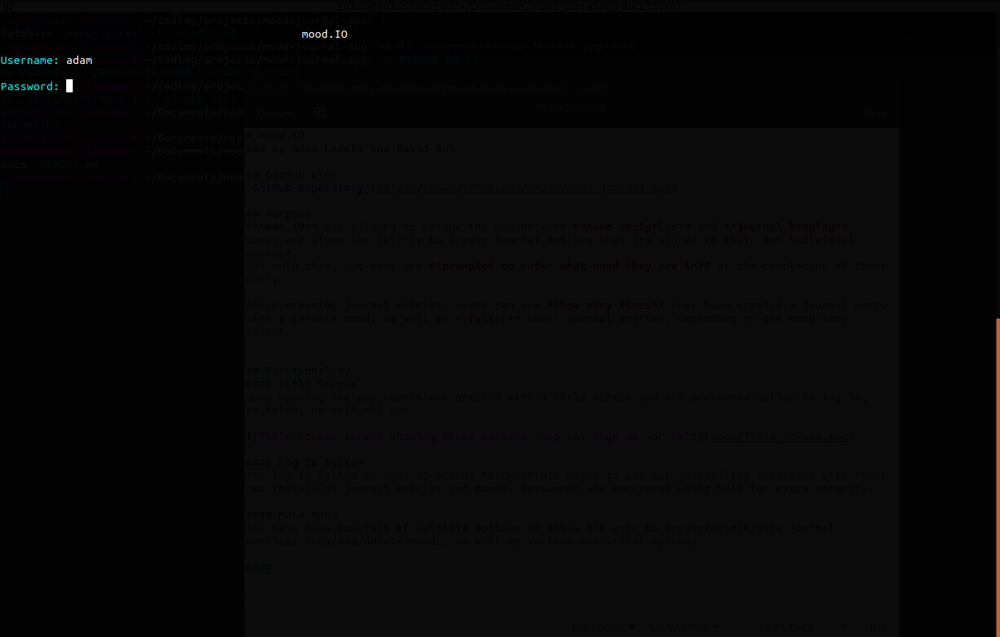

# mood.IO
### by Adam Ladell and David Bui

## GitHub Link
[GitHub Repository](https://www.github.com/en3on/mood-journal-app)

## Purpose
**mood.IO** was allowed to bridge the gap between **mood analytics** and **journal keeping**.
Users are given the ability to create journal entries that are stored to their own individual account.
Not only that, but they are **prompted to enter what mood they are in** at the completion of their entry.

After creating journal entries, users can see **how many times** they have created a journal entry with a certain mood, as well as **filter** their journal entries, depending on the mood they select.

## Functionality
#### Title Screen
Upon opening the app, users are greeted with a title screen and are presented option to log in, register, or exit the app.

#### Log In System
The log in system in mood.IO allows for multiple users to use our journalling app, each with their own individual journal entries and moods. Passwords are encrypted using SHA2 for extra security.

User files are stored under 'database/journals', moodlists are stored under 'database/moods' and passwords are stored under 'database/password'.

Each file is named using the username provided during the registration as this provides an easy way to lookup user files and match passwords with users.

#### Main Menu
The main menu consists of multiple options to allow the user to create/delete/view journal entries; view/add/delete moods; as well as various analytical options.

#### Journal Entry
**mood.IO** allows users to enter multi-line journal entries enabling a greater sense of style within each individual entry.

Users are then presented with a menu to select which of their **custom set moods** to tag the entry under

#### Filter Moods
**mood.IO** gives users the ability to filter their journal entries by moods. This allows greater accessibility in accessing specific journal entries

## Instructions

#### Registering/ Logging In
When opening **mood.IO** you will be presented with the option to either **log in** or **sign up**.

When registering, please enter a desired username and password.

If your chosen username is already in use, you will be prompted to choose a new username.

**Please remember your username AND password as these will be needed for viewing your individual journal entries!**

When logging in, type in your account's username and password.

Following that, you will be presented with the main menu

#### Adding/ Deleting Custom Moods
Before creating a journal entry in **mood.IO**, it is vital to create your own custom moods to choose from. Moods can be added and subsequently deleted at any time.

## Creating a new journal entry
When choosing to create a new journal entry, you will be prompted for a title to give the entry.
Enter this title and press "Enter" to submit the title and move onto writing content.

mood.IO uses a multi-line text editing system. In order to escape from this mode, type "EXIT" (without quote) on a new line.

mood.IO will then ask for you to input what mood you would like to file this entry under from the list of moods you have specified.

#### Viewing journal entries
There are 2 main ways to view journal entries.

Firstly, you may view journal entries by selecting "View Journal Entries" and subsequently selecting the number of the entry you would like to view

Secondly, you may filter out the journal entries by mood by selecting the option "Filter entries by mood". After choosing a mood, you will be displayed a list of journal entries matching that mood. You can view entries the same way as before, by inputting the number of the entry you wish to view.

#### Deleting a journal entry
To delete a journal entry, select the option "Delete Journal Entry".
Following this you will be presented with a numbered list of the entries you currently have saved. 
Enter the number associated with the entry you wish to delete in order to remove it.

## Project Timeline
Our initial project idea was to:

> "Create an app that lets users create journal entries that are tagged with a certain mood and allow the user to display the amount of times a mood was used."

We went above and beyond our initial app idea, adding the ability to support **multiple users**, add and delete **custom moods** and **filter journal entries** by certain moods.

We allocated tasks based on the role they played in the app, with **David** taking mostly UI related tasks, and **Adam** taking mostly mechanics related tasks.

## Time based change log

05/03 @12:30 David: Created a main menu system

05/03 @ 12:45pm - Adam: Created file write system and journal entry system

05/03 @ 12:55pm Adam: Added mood functionality to journal entry system

05/03 @ 1.04pm David : Created a view_mood_list def

05/03 @ 3pm David : Created a custom mood system

05/03 @ 3pm Adam: Created fully functioning read/ write system

05/03 @ 3:30pm Adam: Created fully functioning journal entry list displayed and content reader

05/03 @ 7:50pm Adam: Created functioning mood counter to display the most used moods

05/03 @ 8:30pm Adam: Added function to remove journal entries and added exit options to return to main menu
 
05/03 @ 8.35pm David Reconfiguring the mood system

05/03 @ 9.10pm David finished configuration for the mood system - added preventative measure to ensure user does not add numbers or symbols, when users are inputting their mood to the system. 

05/03 @ 10pm David about to pass out. Just finished a clean simple main menu. I won’t add anymore animation as it can get really complex and also i think its best to leave the animation in the main menu only, for good reasons.

06/03 @ 10:43am David created a title with ASCII included.

06/03 @ 10.56am David created a log in screen

06/03 @ 11:00am Adam: Created a multi user log in/ registration system

06/03 @ 11.09am David created a register screen

06/03 @ 12:30pm Adam: Created a function to filter journal entries by certain moods

06/03 @ 1:00pm Adam: Added animations and colors to UI

